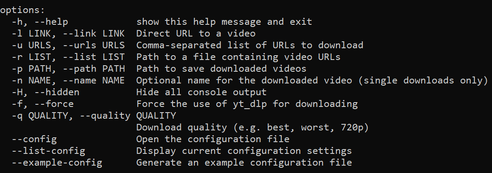

# Cerberus
>by @[Necrqum](https://github.com/necrqum) | start: 12/12/2025

[](https://github.com/necrqum/cerberus/releases)
[](https://opensource.org/licenses/MIT)
[](https://www.python.org/downloads/)
[](#)
---
<p align="center">
  <pre>
                / \_/\____,
      ,___/\_/\ \  ~     /
      \    ~  \ )   XXX
       XXX     /     /\_/\___,
          \o-o/-o-o/   ~    /
           ) /     \    XXX
          _|    / \ \_/
       ,-/   _  \_/   \
      / (   /____,__|  )
     (  |_ (    )  \) _|
    _/ _)   \   \__/   (_
   (,-(,(,(,/      \,),),)
  </pre>
</p>

---

<details>

<summary>etymology</summary>

  

The guardian fetches things from the 'underworld' of the internet.
› Read more about the [Ceberus](https://en.wikipedia.org/wiki/Cerberus).
  

</details>

**Cerberus** is a robust Command-Line Interface (CLI) tool designed to fetch and download videos from across the "underworld" of the internet. By combining the power of [**Selenium**](https://github.com/SeleniumHQ/Selenium) network logging and [**yt-dlp**](https://github.com/yt-dlp/yt-dlp), it can extract media even from websites that don't provide direct download links.

---

## Navigation
[Features](#-key-features) • [Installation](#-installation) • [Usage](#-usage-examples) • [Releases](https://github.com/necrqum/cerberus/releases)

---

## Key Features
- **Dual-Engine Extraction**: Uses `yt-dlp` for known hosts and a Selenium-based network logger to intercept direct video URLs (`.mp4`, `.m3u8`, etc.) from any site.

- **Smart Session Numbering**: Automatically handles pages with multiple videos. It numbers them (e.g., `Video(1).mp4`) within a session to ensure no content is skipped.

- **Automatic Sorting**: Organizes your downloads into subfolders based on Platform, Artist, or Genre by parsing metadata and Open Graph tags.

- **Centralized Config**: Automatically creates a configuration directory in `%APPDATA%/.cerberus` (Windows) or `~/.cerberus` (Linux/Mac) to keep your workspace clean.

- **FFmpeg Integration**: Seamlessly handles HLS streams and video conversions using FFmpeg.

---

## Installation
1. **Clone the repository**:
```bash
git clone https://github.com/necrqum/cerberus.git
cd cerberus
```
2. **Install dependencies**:
```bash
pip install .
```
*This will install all required packages: `selenium`, `yt-dlp`, `requests`, `browser-cookie3`, `beautifulsoup4`, and `tqdm`.*

3. **Initial Setup**: Run the config command to generate your `Settings.txt`:
```bash
cerberus --config
```
*Make sure to set your `browser_path` to your local Chrome/Edge or other Chromium-Browser `.exe` in the settings file.*

> [!IMPORTANT]
> **FFmpeg is required** for merging video/audio tracks and downloading HLS streams - in PATH. 
> - **Windows:** [Download via Gyann.dev](https://www.gyan.dev/ffmpeg/builds/)
> - **Linux:** `sudo apt install ffmpeg`
> - **macOS:** `brew install ffmpeg`

---

## Usage Examples
Single Video Download
```bash
cerberus -l "https://example.com/video-page" -p "./my_downloads"
```
Batch Download (Comma-separated)
```bash
cerberus -u "https://site1.com/vid1,https://site2.com/vid2"
```
Download from List File
```bash
cerberus -r urls.txt
```
Force yt-dlp Engine
```bash
cerberus -l "https://youtube.com/watch?v=..." -f
```
View every available command, with helpfull instructions
```bash
cerberus -h
```
<details>
<summary>View help-output</summary>



</details>

---

## Configuration
You can manage your settings via the CLI or by editing `Settings.txt` directly.

| Argument | Description |
|     :---:      |     :---:      |
| `--config`     | Opens the settings file in your default text editor. |
| `--list-config` | Prints all current settings to the terminal. |
| `--example-config` | Generates a template with all available options. |

`example_settings.txt`:


Available Settings Highlights:
- `sort_by`: `artist`, `platform`, `genre`, or `none`.
- `overwrite_existing`: `true` or `false`.
- `default_quality`: Choose `best`, `worst`, or `specific` resolutions like `720p`.
- `use_browser_cookies`: Enable to use your browser's login session (useful for restricted sites).

---

## Project Structure
- `cerberus/downloader.py`: The core logic for extraction and downloading.

- `setup.py`: Package configuration for installation.

- `README.md`: Documentation.

- `Settings.txt`: User-specific configurations (generated on first run).

---

## License & Legal
Distributed under the MIT License.
**Disclaimer**: This tool is for technical and educational purposes only. Users are responsible for complying with the terms of service of the websites they visit and ensuring they have the right to download any content.

---

## Roadmap / Todo
- [ ] Fix overwrite_existing=true parameter logic

- [ ] Implement full unit testing suite

- [ ] Fix youtube.com downloads

- [x] Centralize program files/config

- [x] Add automated metadata-based sorting

- [x] Improve error handling for failed Selenium instances

---